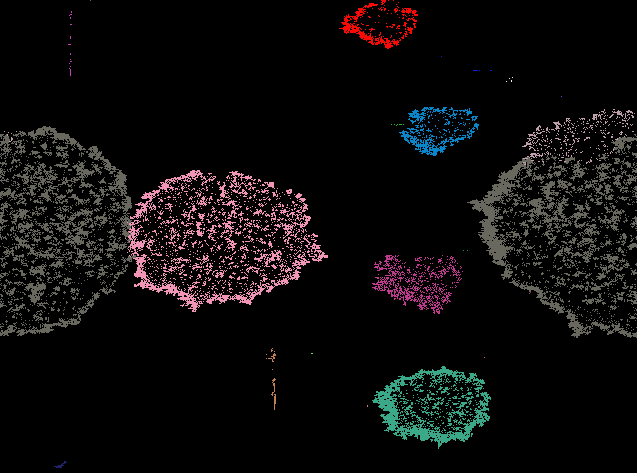
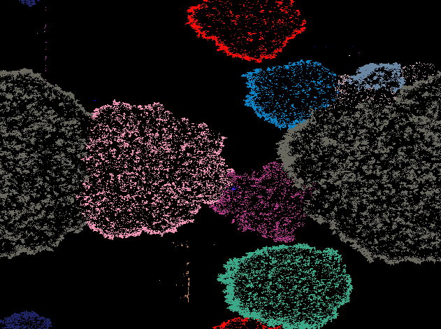

# nanopond -- genetic programming
In this exercise we will explore the fundamentals of genetic programming by exploring a 2D world in which little programs compete for domination.

##	Introduction: NanoPond
Start the program by the main file NanoPond.java.

The NanoPond world consists of 640x480 cells, and each cell contains a program of 512 instructions taken from a particular instruction set (section 3, next page). They form the genome of the cell. Each cell also has a certain amount of energy, and the cell dies when its energy level reaches 0. Initially, all programs contain 512 STOP instructions and they evolve over time to form more intelligent programs that try to dominate their neighbours, replicate themselves and take over the world.

All self-replicating programs are shown on the graphical interface, each pixel representing one cell. There is a zoom window which allows you to look into more detail at a certain cell and its neighbours. If two cells are painted in the same colour, they originate from a common ancestor. By clicking on a cell, a print-out of its genome is shown.

Early evolution of a few replicators



Same replicators several million years later.



## Behind the scenes
The main loop is executed in the code of NanoPond.java, more precisely in the run() method. Every iteration represents one year in which a random cell is picked and its program instructions executed. Each instruction costs one point of energy. Each cell can use a memory buffer of 512 values and one register. The register can store an instruction from the buffer or the genome, and the instruction stored in the register can also be written back to the buffer or the genome. There is a pointer which can be used to index either a place in the genome or in the buffer, according to the specific instruction.

At the end of each iteration, the output of the program can be written to a neighbouring cell if the program has produced some output in the memory buffer. Each 100 years, a random cell is given a certain amount of energy and a random set of instructions. We call this process seeding and it may overwrite an existing cell.

## Instruction set
The set of instructions to form a program contains 16 possible codes:
```
  0: ZERO: reinitialise the pointer and the register to 0
  1: FWD: increment the pointer with 1 (modulo 512)
  2: BACK: decrement the pointer with 1 (modulo 512)
  3: INC: increment the register with 1 (modulo 16)
  4: DEC: decrement the register with 1 (modulo 16)
  5: READG: access the value of the genome as indexed by the pointer, copy to register
  6: WRITEG: write the value of the register back to the genome as indexed by the pointer
  7: READB: access the value of the buffer as indexed by the pointer, copy to register
  8: WRITEB: write the value of the register back to the buffer as indexed by the pointer
  9: LOOP: create a loop, jump forward to the according REP when the register equals 0
  a: REP: go back to the according LOOP when the register is not equal to 0
  b: TURN: turn cell orientation
  c: XCHG: ignore the next instruction and exchange its value with that of the register
  d: KILL: try destroying the neighbouring cell
  e: SHARE: try sharing its energy and that of its neighbour equally amongst eachother
  f: STOP: stop executing
```

##	Self-replication
Run the program for a few minutes and study the evolution of the programs in the world. Often, a few programs tend to dominate their neighbors and expand quickly.
1.	Based on the set explained in section 3, can you think of a minimal set of instructions that could enable a program to replicate itself? We will call it Program X.
2.	Locate a self-replicating program in your world, and inspect its instruction set. How does this genome differ from the one of the theoretical Program X?
3.	We will now give birth to Program X. To do so, we make use of the god-mode which enables the user to introduce a new program into the world at a random location. Define the program by its hexadecimal instructions. Trailing STOP instructions do not have to be specified. Eg. “9a” is a program consisting of a LOOP and a REP instruction, followed by 510 STOP instructions. The coordinate of the newly introduced program is given, with (0,0) being the pixel in the upper left corner.
##	Mutation
Inspect the main loop implemented in the run() method of NanoPond.java. It provides a mechanism to introduce variation into the world by changing the current instruction or the register.
1. Implement a duplication and a deletion mutation at the correct place in the code (around line 430).
2. Add a more realistic copying mechanism which sporadically introduces small errors when copying a cell into its neighbor (around line 620).

##	World Domination
Can you design a program to dominate the world? Let yourself be inspired by naturally evolved dominators! Test your creations by introducing them into an existing world with the god-mode. 

## Example programs
This is a  list of example hexadecimal species that are successful replicators
```
apple   56322429e51758d7da2ea0f
pear    dd39581eea0f
orange  495813ead
lemon   53333d958e1a0f
lime    d7d9581ea0f
        dd7de9581a0f
```